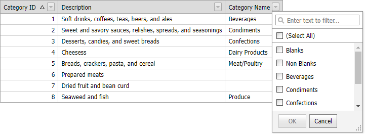

<!-- default badges list -->

[](https://supportcenter.devexpress.com/ticket/details/E4218)
[](https://docs.devexpress.com/GeneralInformation/403183)
[](#does-this-example-address-your-development-requirementsobjectives)
<!-- default badges end -->

# Grid View for ASP.NET Web Forms - How to create ShowBlanksValue and ShowNonBlanksValue items in the header filter

[GridViewDataComboBoxColumn](https://docs.devexpress.com/AspNet/DevExpress.Web.GridViewDataComboBoxColumn) does not render **(Blank)** and **(NonBlank)** items if the [HeaderFilterMode](https://docs.devexpress.com/AspNet/DevExpress.Web.GridDataColumnSettings.HeaderFilterMode) property is set to `CheckedList`. 
Call the [FilterValue.CreateShowBlanksValue](https://docs.devexpress.com/AspNet/DevExpress.Web.FilterValue.CreateShowBlanksValue(DevExpress.Web.GridViewDataColumn-System.String)) and [FilterValue.CreateShowNonBlanksValue](https://docs.devexpress.com/AspNet/DevExpress.Web.FilterValue.CreateShowNonBlanksValue(DevExpress.Web.GridViewDataColumn-System.String)) methods in the [HeaderFilterFillItems](https://docs.devexpress.com/AspNet/DevExpress.Web.ASPxGridView.HeaderFilterFillItems) event handler to add these items.



```csharp
protected void grid_HeaderFilterFillItems(object sender, ASPxGridViewHeaderFilterEventArgs e) {
    if (e.Column.FieldName != "CategoryNameNull")
        return;
    e.Values.Insert(0, FilterValue.CreateShowBlanksValue(e.Column, "Blanks"));
    e.Values.Insert(1, FilterValue.CreateShowNonBlanksValue(e.Column, "Non Blanks"));
}
```

## Files to Review

* [Default.aspx](./CS/WebSite/Default.aspx) (VB: [Default.aspx](./VB/WebSite/Default.aspx))
* [Default.aspx.cs](./CS/WebSite/Default.aspx.cs) (VB: [Default.aspx.vb](./VB/WebSite/Default.aspx.vb))
<!-- feedback -->
## Does this example address your development requirements/objectives?

[](https://www.devexpress.com/support/examples/survey.xml?utm_source=github&utm_campaign=asp-net-web-forms-grid-blanks-and-non-blanks-header-filter-items&~~~was_helpful=yes) [](https://www.devexpress.com/support/examples/survey.xml?utm_source=github&utm_campaign=asp-net-web-forms-grid-blanks-and-non-blanks-header-filter-items&~~~was_helpful=no)

(you will be redirected to DevExpress.com to submit your response)
<!-- feedback end -->
